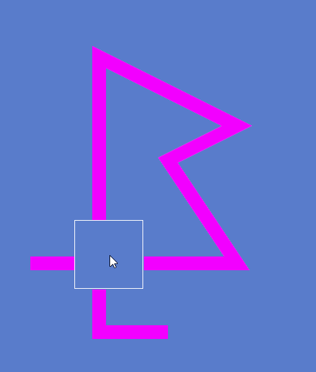

# Renderer

A basic D3D11 renderer, currently it has a lot that needs to get done.

### Current features

- Primitive drawing
- Polylines
- Text drawing
- Scissoring and color keying

### Preview

#### Bezier Curves

#### Polylines

### TODO

A rough list of random thoughts for improvement, some are terrible ideas if it's so bad and you care maybe recommend  
a proper solution then? And I'll give it a shot.

Some of the ideas are stupid and are just to ask people who know more then me later. So I'm just throwing them on here.

One thing everything needs a little bit of is documentation and also there are probably typos everywhere luckily no one  
cares.

 - Renderer
   - Vulkan
   - D3D11
     - Textures
       - [ ] Get a better understanding of textures
       - [ ] Understand UV more
     - [ ] Recode the whole thing
     - [ ] Proper format usage and flags for everything
     - [ ] Fix depth stencil crash when minimized
     - [ ] Instancing support
     - [ ] MSAA
     - [ ] Check GPU type and properly setup NVIDIA/AMD
   - Buffer
     - Primitives
       - [ ] Improve rounded_rectangle_filled mesh
         - current create_arc function the center of a triangle fan cannot be set and it would be optimal if it was  
         all from the center so there is no center area to fill
       - [ ] Make sure proper size is reserved
       - [ ] Make sure drawing is the correct size like 1px thick rect thats 3x3 should have 1px hole
     - Special effects
       - [ ] Make sure scissor bounds stay proper when multiple are nested
       - [ ] Whole pixel shader for each effect since that's the best way to do it
       - [ ] Fix color keying
       - [ ] Blur impl
     - [ ] Elegant way for adding vertices from the heap or stack maybe one of these ways
       - Create directly on vertex buffer
       - Cleanup add_vertices somehow and support static, heap, and vector array data
     - [ ] Review functions and choose final argument order
   - Fonts
     - [ ] Font atlas generation
     - [ ] Font bitmap/texture creation with minimal binary footprint
   - Polyline
     - [ ] Optimize
     - [ ] Fix intersections
     - [ ] Fix other joint types
 - Carbon
   - Layout engine
     - Grid container
       - [ ] More functionality like CSS grid containers
     - Flex container
       - [ ] Flex line container system since both container and line are just base containers so how can I move the  
       flex container children into the flex line then split the flex lines children into another line in the container  
       if wrapping is enabled and the container content area is exceeded
     - Flex line
       - [ ] Content minimum constraints
       - Children should be able to escape if minimum isn't clamped yet and use extra thickness from margin, etc
       - [ ] Fix shrinking since it currently doesn't properly recompute after changing free space when something cannot  
         flex anymore
       - [ ] Optimize compute since I doubt the current way is optimal (gonna be hard)
       - [ ] Caching
         - If we do this do we have to setup setters for everything otherwise how do we know when to mark an item dirty  
         since it's marked as dirty if a variable for it's size changes
       - [ ] What size do we even make the cross axis if the size is not set to streach
       - [ ] Differnt align content options
       - [ ] Add justify_streach and respect constraints
       - [ ] Would keyword constructors be cool or is that super stupid in C++
     - Flex item
       - [ ] Way without adding drawing or input stuff for later on without needing to define the virtuals here since  
       stuff widgets do should not be known by the layout engine, just shouldn't be that way imo
     - [ ] Inheritable options for flex properties
     - [ ] Should initializer list be used or should we be explicit with constructors
     - [ ] Should we return a ptr to self when calling useless set functions on for this type stuff self->set()->set()
     - [ ] Document axes system for when my brain can no longer handle it
     - [ ] Review constructors and compare to CSS shorthand
     - [ ] Does a glm vector sum function exist?
   - Themes
     - [ ] Create variables we will need
     - [ ] System for managing
   - Input system
     - Keyboard information
       - [ ] is pressed
       - [ ] is down
       - [ ] is released
       - [ ] last pressed key
     - Mouse information
       - [ ] Position
       - [ ] Button information
       - [ ] Vertical and horizontal scroll
     - [ ] Check if we need anything else added
     - No idea what design to go with for this part
   - Widgets
     - Builder
       - [ ] Maybe ability to load from something like XML
       - [ ] Complete control
     - [ ] Snap grid ideas
       - Basically everything should be able to be dragged around
     - [ ] Animation timing design
     - [ ] How should widgets be able to have tooltips added to them if flex_items don't have children?
       - Maybe call things that can be added to widgets that are non container types something idk the word
   - Refactor
     - [ ] Function naming
     - [ ] Variable naming
     - [ ] See what can be refactored and how it would improve
   - Crossplatform
     - [ ] Probably need some defines for things like OSX, UNIX, Windows
     - [ ] Are the functions I'm using like fmodf the right one to use
   - [ ] Do anon namespace before C functions just so it can easily be noticed
   - [ ] Learn ways to optimize more things
   - [ ] Make sure the correct container types are always being used
   - [ ] Remove unused junk code if useless
   - [ ] What could we even do in async
   - [ ] Proper voliatle marking for multithreading
   - [ ] Should global layout get changed?
   - [ ] Convert to own CMake then just add inside of libs and just edit there so they are not mixed
   - [ ] Check everything when not sleep deprived or in insane pain (both rn)
   - [ ] Can we use standard stuff like vector or should we not to avoid crt stuff
   - [ ] Take a break from this maybe or have someone review everything and get their feedback and then use it