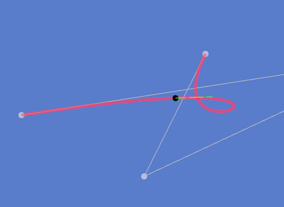
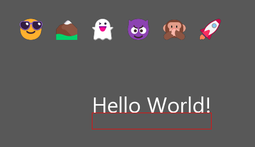

# Renderer
Simple 2D renderer using D3D11 and FreeType.

### Features
- Primitive geometry  
  
  - Point
  - Line
  - Rectangle (Outline, Filled, Rounded)
  - Arc (Outline, Filled)
  - Circle (Outline, Filled)
  - Polyline (with multiple cap and joint types to select from)
  - Textured quadrants
- Bezier curves  
  
- Text rendering  
  
  - Supports all string types such as string, u32string, wstring
  - Colored glyph support
- Command buffer options
  - Color keying
  - Scissoring
  - Texture mapping
- Too many color classes with every format type imaginable
- Buffer swapping

### Usage
```cpp
auto application = std::make_unique<renderer::win32_window>();
application->set_title("D3D11 Renderer");
application->set_size({1920, 1080});

// Create Win32 window
if (!application->create()) {
	MessageBoxA(nullptr, "Failed to create window.", "Error", MB_ICONERROR | MB_OK);
	return 1;
}

auto dx11 = std::make_unique<renderer::d3d11_renderer>(carbon::application.get());

// Initialize D3D11 pipeline
if (!dx11->init()) {
	MessageBoxA(nullptr, "Failed to initialize renderer.", "Error", MB_ICONERROR | MB_OK);
	return 1;
}

dx11->set_vsync(false);
dx11->set_clear_color({88, 88, 88});

// Create fonts
auto segoe_font = dx11->register_font("Segoe UI Emoji", 10, FW_THIN, true);

auto close_requested = false;

// Spawn thread for drawing to the buffer
std::thread draw([&dx11, &close_requested]{
	const auto id = dx11->register_buffer();
	
	while (!close_requested) {
		auto buf = dx11->get_working_buffer(id);
		
		buf->draw_rect_filled({50.0f, 50.0f, 100.0f, 100.0f}, COLOR_RED);
		
		dx11->swap_buffers(id);
	}
});

application->set_visibility(true);

// Run peek message loop
MSG msg{};
while (!close_requested && msg.message != WM_QUIT) {
	while (PeekMessage(&msg, nullptr, 0U, 0U, PM_REMOVE)) {
		TranslateMessage(&msg);
		DispatchMessage(&msg);
	}

	if (msg.message == WM_NULL && !IsWindow(application->get_hwnd())) {
		close_requested = true;
		break;
	}
	
	// NOTE: In your WndProc do something similar to this
	//case WM_SIZE:
	//      carbon::application->set_size({LOWORD(lParam), HIWORD(lParam)});
	//      update_size = true;
	
	if (update_size) {
		dx11->resize();
		carbon::dx11->reset();
		
		update_size = false;
	}

	// Render frame
	dx11->draw();
}

// Exit thread
draw.join();

// Release resources
dx11->release();
application->destroy();

return 0;
```